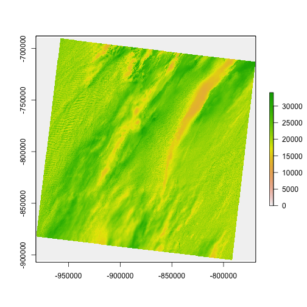

getlandsat
==========


[](https://travis-ci.org/ropensci/getlandsat)
[](https://codecov.io/gh/ropensci/getlandsat)
[](https://github.com/metacran/cranlogs.app)
[](https://cran.r-project.org/package=getlandsat)
[](https://github.com/ropensci/onboarding/issues/58)

`getlandsat`: Get Landsat 8 data from AWS public data sets

`getlandsat` provides access to Landsat <https://landsat.usgs.gov> 8 metadata and images hosted on AWS S3 at <https://registry.opendata.aws/landsat-8/>. The package only fetches data. It does not attempt to aid users in downstream usage, but some additional functionality may be added.

A new function `lsat_search()` lets you search for Landsat images by using the API from Development Seed documented at <https://github.com/sat-utils/sat-api>

Potential users are probably anyone from scientists asking questions about biodiversity or land use change, to software developers creating tools for users to vizualize their data.

## Install

Stable version


```r
install.packages("getlandsat")
```

Dev version


```r
devtools::install_github("ropensci/getlandsat")
```


```r
library("getlandsat")
```

## Search for images

```{r eval=FALSE}
x <- lsat_search(collection = "landsat-8", cloud_cover = c(0, 20), limit = 3)$features
names(x)
#> [1] "type"       "properties" "bbox"       "geometry"   "assets"     "links"
x$properties
#>                                         id         c:id                 datetime eo:cloud_cover eo:sun_azimuth
#> 1 LC08_L1TP_183023_20160625_20170323_01_T1 landsat-8-l1 2016-06-25T09:00:16.825Z              0      150.61964
#> 2 LC08_L1TP_183037_20160625_20170323_01_T1 landsat-8-l1 2016-06-25T09:05:51.253Z             19      110.95730
#> 3 LC08_L1TP_183041_20160625_20170323_01_T1 landsat-8-l1 2016-06-25T09:07:26.830Z              0       95.69133
#>   eo:sun_elevation landsat:path landsat:row
#> 1         57.71269          183          23
#> 2         68.16356          183          37
#> 3         68.55517          183          41
```

## List scenes


```r
(res <- lsat_scenes(n_max = 10))
#> # A tibble: 10 x 11
#>    entityId acquisitionDate     cloudCover processingLevel  path   row
#>    <chr>    <dttm>                   <dbl> <chr>           <int> <int>
#>  1 LC80101… 2015-01-02 15:49:05      80.8  L1GT               10   117
#>  2 LC80260… 2015-01-02 16:56:51      90.8  L1GT               26    39
#>  3 LC82270… 2015-01-02 13:53:02      83.4  L1GT              227    74
#>  4 LC82270… 2015-01-02 13:52:38      52.3  L1T               227    73
#>  5 LC82270… 2015-01-02 13:48:14      38.8  L1T               227    62
#>  6 LC82111… 2015-01-02 12:30:31      22.9  L1GT              211   115
#>  7 LC81791… 2015-01-02 09:14:45       7.67 L1GT              179   120
#>  8 LC82111… 2015-01-02 12:28:55      43.4  L1GT              211   111
#>  9 LC81950… 2015-01-02 10:17:20      21.0  L1T               195    29
#> 10 LC81790… 2015-01-02 08:44:49       1.92 L1T               179    45
#> # ... with 5 more variables: min_lat <dbl>, min_lon <dbl>, max_lat <dbl>,
#> #   max_lon <dbl>, download_url <chr>
```

## List scene files


```r
lsat_scene_files(x = res$download_url[1])
#>                                 file    size
#> 2   LC80101172015002LGN00_B4.TIF.ovr   7.7MB
#> 26 LC80101172015002LGN00_B11.TIF.ovr  17.0KB
#> 3       LC80101172015002LGN00_B5.TIF  56.8MB
#> 4      LC80101172015002LGN00_BQA.TIF   2.7MB
#> 5      LC80101172015002LGN00_MTL.txt   7.5KB
#> 6   LC80101172015002LGN00_B5.TIF.ovr   7.8MB
#> 7   LC80101172015002LGN00_B2.TIF.ovr   7.5MB
#> 8   LC80101172015002LGN00_B1.TIF.ovr   7.5MB
#> 9   LC80101172015002LGN00_B7.TIF.ovr   7.9MB
#> 10      LC80101172015002LGN00_B4.TIF  55.4MB
#> 11      LC80101172015002LGN00_B8.TIF 212.3MB
#> 12  LC80101172015002LGN00_B3.TIF.ovr   7.6MB
#> 13      LC80101172015002LGN00_B3.TIF  54.4MB
#> 14      LC80101172015002LGN00_B2.TIF  54.0MB
#> 15 LC80101172015002LGN00_B10.TIF.ovr  17.0KB
#> 16  LC80101172015002LGN00_B6.TIF.ovr   7.9MB
#> 17  LC80101172015002LGN00_B9.TIF.ovr   7.0MB
#> 18     LC80101172015002LGN00_B11.TIF   0.1MB
#> 19  LC80101172015002LGN00_B8.TIF.ovr  29.0MB
#> 20      LC80101172015002LGN00_B1.TIF  54.2MB
#> 21     LC80101172015002LGN00_B10.TIF   0.1MB
#> 22      LC80101172015002LGN00_B6.TIF  58.0MB
#> 23 LC80101172015002LGN00_BQA.TIF.ovr   0.6MB
#> 24      LC80101172015002LGN00_B7.TIF  58.0MB
#> 25      LC80101172015002LGN00_B9.TIF  49.6MB
```

## Get an image

Returns path to the image


```r
lsat_image(x = "LC80101172015002LGN00_B5.TIF")
#> [1] "/Users/sckott/Library/Caches/landsat-pds/L8/010/117/LC80101172015002LGN00/LC80101172015002LGN00_B5.TIF"
```

### Caching

When requesting an image, we first check if you already have that image. If you do,
we return the path to the file. If not, we get the image, and return the file path.


```r
lsat_image(x = "LC80101172015002LGN00_B5.TIF")
#> File in cache
#> [1] "/Users/sckott/Library/Caches/landsat-pds/L8/010/117/LC80101172015002LGN00/LC80101172015002LGN00_B5.TIF"
```

Note the message given.

See `?lsat_cache` for cache management functions.

## Visualize


```r
library("raster")
x <- lsat_cache_details()[[1]]
img <- raster(x$file)
plot(img)
```



## Meta

* Please [report any issues or bugs](https://github.com/ropensci/getlandsat/issues).
* License: MIT
* Get citation information for `getlandsat` in R doing `citation(package = 'getlandsat')`
* Please note that this project is released with a [Contributor Code of Conduct](CODE_OF_CONDUCT.md). By participating in this project you agree to abide by its terms.

[](https://ropensci.org)
